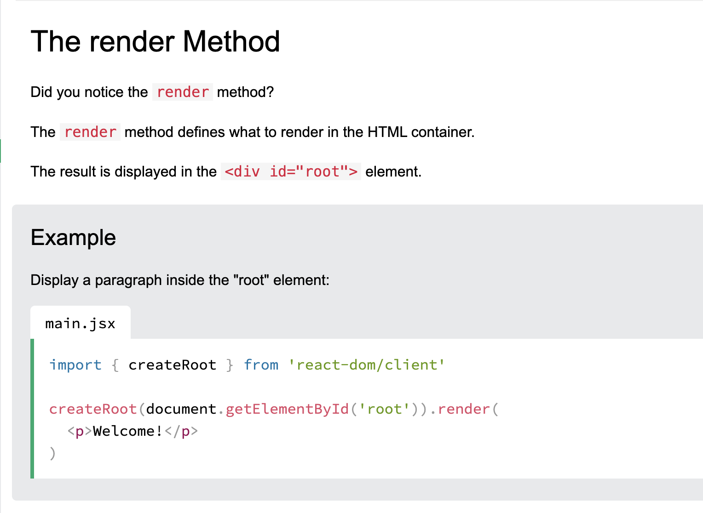
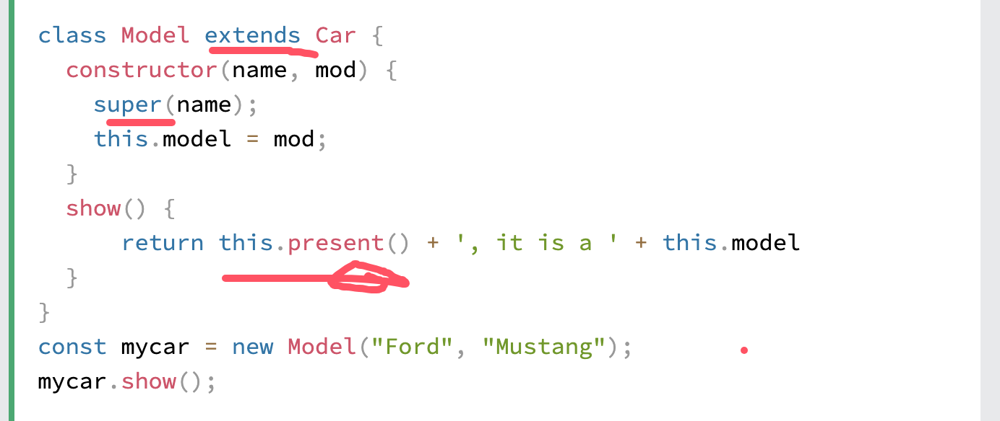

# ReactLearning

- [React Start](https://react.dev/learn)
- [React Tutorial](https://www.w3schools.com/REACT/DEFAULT.ASP)
- [Vite](https://vite.dev/)
- [node.js](https://nodejs.org/en)

## React Tutorial
[React Tutorial](https://www.w3schools.com/react/default.asp)

- React is a JavaScript library for building user interfaces.
- React is used to build single-page applications.
- React allows us to create reusable UI components
## React Introduction
[React Introduction](https://www.w3schools.com/react/react_intro.asp)

## Your First React App
[Your First React App](https://www.w3schools.com/react/react_first_app.asp)

## React Render HTML
[React Render HTML](https://www.w3schools.com/react/react_render.asp)

React's goal is in many ways to render HTML in a web page.
React renders HTML to the web page via a container, and a function called ```createRoot()```

## The Container
Typically, this container is a ```<div id="root"></div>``` element in the ```index.html``` file.

## The createRoot Function
The ```createRoot``` function is located in the main.jsx file in the ```src``` folder, and is a 
built-in function that is used to create a root node for a React application.

```
main.jsx
import { StrictMode } from 'react'
import { createRoot } from 'react-dom/client'
import './index.css'
import App from './App.jsx'

createRoot(document.getElementById('root')).render(
  <StrictMode>
      <App />
    </StrictMode>
  )  

```
The createRoot()function takes one argument, an HTML element.
THe purpose of the function is do define the HTML element where a React component should be displayed.

## The render Method

The ```render``` method defines what to render in the HTML container

The result is displayed in the <div id="root"> element.



Note: the element id does not have to be "root ", but this is the standard convention.

## The HTML Code
[The HTML Code](https://www.w3schools.com/react/react_render.asp)
## The Root Node
The root node is the HTML element where you want to display the result.
It is like a container for content, managed by React.
It does NOT have to be a ```<div>``` element and it does NOT have to have the ```id="root" ```:

## Upgrade React
[Upgrade React](https://www.w3schools.com/react/react_upgrade.asp)

## React ES6
[React ES6](https://www.w3schools.com/react/react_es6.asp)

## What should i Learn Es6
- Classes
- Arrow Functions
- Variables(let,const,var)
- Array Methods like .map()
- Destructuring
- Modules
- Ternary Operator
- Spread Operator
## React ES6 Classe
A class  is  a type of function, but instead of using the keyword ```function``` to initiate it,
we use the keyword ```class```, and the properties are assigned inside a constructor() method.

## Note constructor function is called automatically when the object is initialized.

## Method in Classes
You can add your own methods in a class:
the object's method name followed by parentheses(parameters would og inside the parentheses).
## Class Inheritance
 TO  create a class inheritance, use the ```extends ``` keyword.
 A class created with a class inheritance inherits all the methods
 from another class:


## The super() method refers to the parents class.
By calling the ```super()``` method in the constructor method,
we call the parent's constructor method and get access to 
the parent's properties and methods.
## Arrow Functions 
Arrow functions allow us to write shorter function syntax:

## What about this?
In short, with arrow functions there is no binding of ```this```

**Notice** In regular functions the ```this``` keyword represented the 
object that  called the function, which could be the window, the 
document, a button or whatever.

With arrow functions, the ```this ``` keyword always represents the object 
tht defined the arrow function.

## Remember these differences when you are working with functions.

Sometimes the behavior of regular functions is what you wants,
if not, use arrow functions.

## React ES6 Variables

```
var x =5.6
```

Notice:```var``` has a function scope, not a block scope.
- If you use ```var``` outside of a function, it belongs to the global scope.
- If you use ```var``` inside of a function, it belongs to that function.
- If you use ```var``` inside of a block, i.e. a for loop, the variable is still
available outside of that block.

```
let x=5.6
```

```let``` is the block  scoped version of ```var```, and is limited to the block
(or expression ) where it is defined .
If you use ```let ``` inside of a block, i.e. a for loop, the variable is only
available inside of that loop.
```
let has  a block scop.
```

```const``` is a variable that once it has been created, its value can never change.
```
const has a block scope.
```
The keyword ```const``` is a bit misleading.
It does not define a constant value. It defines a ```constant reference``` to a value.

Because of this you can NOT:
- Reassign a constant value
- Reassign a constant array
- Reassign a constant object

But you CAN:
- Change the elements of constant array
- Change the properties of constant object.

## JavaScript Array map()
[JavaScript Array Map](https://www.w3schools.com/react/react_es6_array_map.asp)

The map() Method
THe map() method creates a new array with the results of calling a function for every array  element.


## map() in React
The map() method is commonly used in React to render lists of elements:

Note:When using map() in React to create list items, 
each item needs a unique ```key`` prop.

## map() with Objects
You can also map() with arrays of objects:

## map() Parameters
[map() Parameter](https://www.w3schools.com/react/react_es6_array_map.asp)

The map() method takes three parameters:
    - currentValue -The current element being processed
    - index -The index of the current  element (optional)
    - array -The array that map was called upon(optional)

## Note:
The map() method always returns a new array. It does not 
modify the original array.

## React ES6 Destructuring
[React destructuring](https://www.w3schools.com/react/react_es6_destructuring.asp)

Destructing is a JavaScript feature that allows you to extract values from objects
or arrays into distinct variables.In React,it's commonly used with **props**, **hooks**, and 
state management.

Note:Destructuring makes React code cleaner and more readable by reducing repetitive object
and array access.

## Destructing Arrays
**Notice**  When destructuring arrays, the order that variables are declared is important.

If we only want the car and suv we can simply leave out the truck but keep the comma:
```
const vehicles=['Tesla','BMW','Benz'];
const [car,,suv]=vehicles;

```

Destructuring comes in handy when a function returns an array.

## Destructuring Objects
[Destructuring Objects](https://www.w3schools.com/react/react_es6_destructuring.asp)
You can use destructing to  extract the values from an object.

**For objects**, the order of the properties does not matter:

## Destructuring in React Components
Destructuring is particularly useful in React
for working with props, hooks, and API responses.
It help make your code more concise and easier to read.

## Props Destructuring
When a component receives props, you can use destructuring to  extract the values you need.
