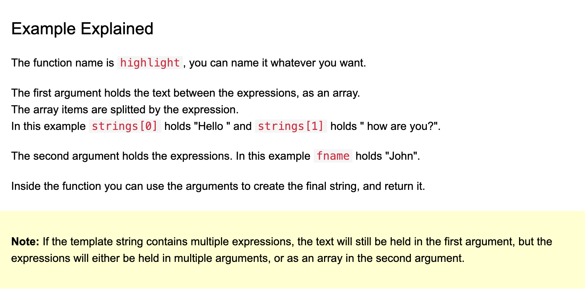
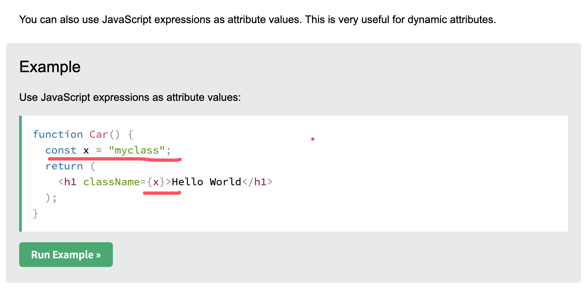
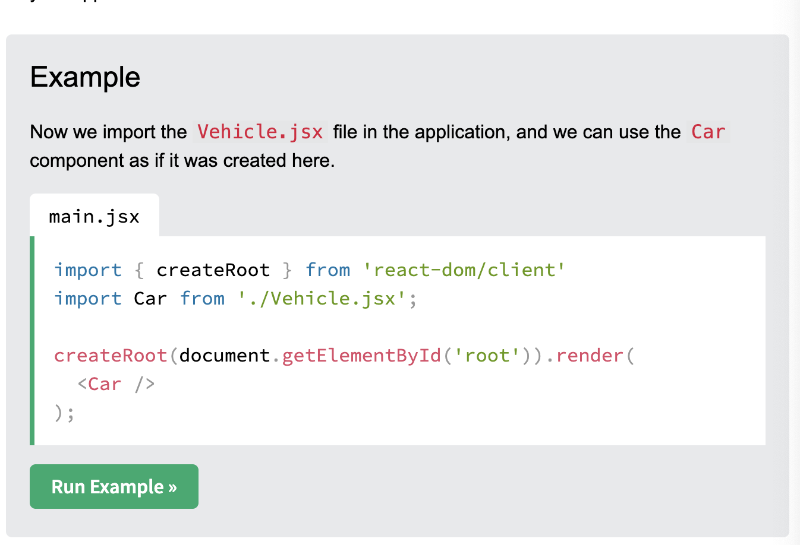
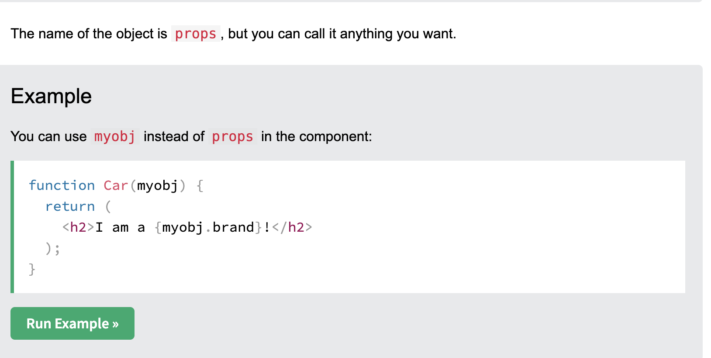
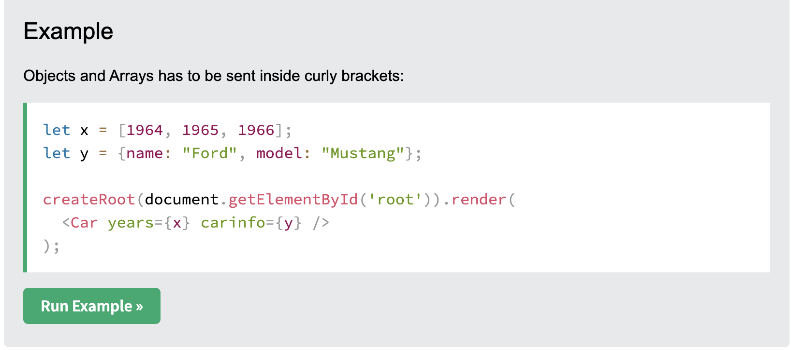
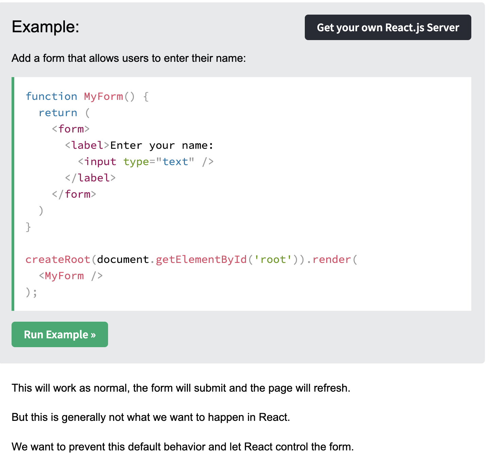
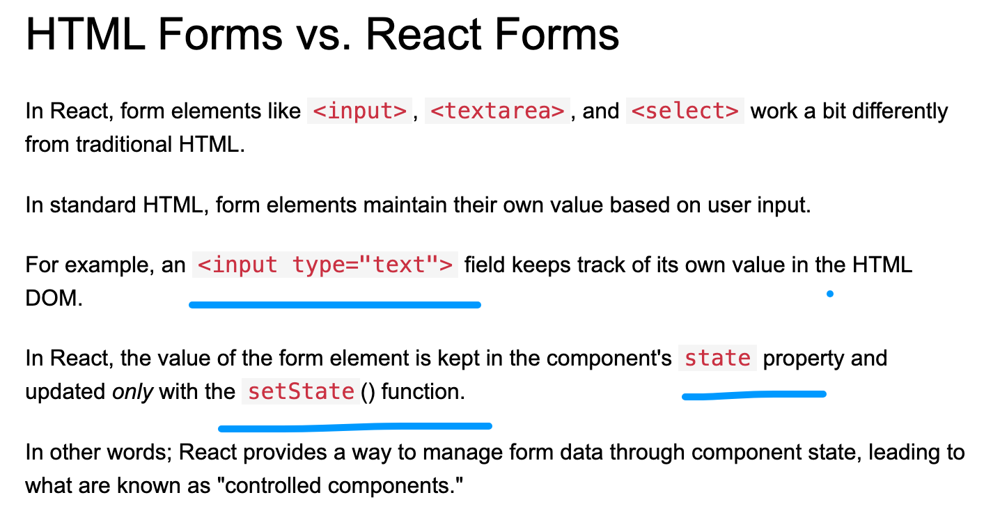

# ReactLearning

- [React Start](https://react.dev/learn)
- [React Tutorial](https://www.w3schools.com/REACT/DEFAULT.ASP)
- [Vite](https://vite.dev/)
- [node.js](https://nodejs.org/en)

## React Tutorial
[React Tutorial](https://www.w3schools.com/react/default.asp)

- React is a JavaScript library for building user interfaces.
- React is used to build single-page applications.
- React allows us to create reusable UI components
## React Introduction
[React Introduction](https://www.w3schools.com/react/react_intro.asp)

## Your First React App
[Your First React App](https://www.w3schools.com/react/react_first_app.asp)

## React Render HTML
[React Render HTML](https://www.w3schools.com/react/react_render.asp)

React's goal is in many ways to render HTML in a web page.
React renders HTML to the web page via a container, and a function called ```createRoot()```

## The Container
Typically, this container is a ```<div id="root"></div>``` element in the ```index.html``` file.

## The createRoot Function
The ```createRoot``` function is located in the main.jsx file in the ```src``` folder, and is a 
built-in function that is used to create a root node for a React application.

```
main.jsx
import { StrictMode } from 'react'
import { createRoot } from 'react-dom/client'
import './index.css'
import App from './App.jsx'

createRoot(document.getElementById('root')).render(
  <StrictMode>
      <App />
    </StrictMode>
  )  

```
The createRoot()function takes one argument, an HTML element.
THe purpose of the function is do define the HTML element where a React component should be displayed.

## The render Method

The ```render``` method defines what to render in the HTML container

The result is displayed in the <div id="root"> element.


Note: the element id does not have to be "root ", but this is the standard convention.

## The HTML Code
[The HTML Code](https://www.w3schools.com/react/react_render.asp)
## The Root Node
The root node is the HTML element where you want to display the result.
It is like a container for content, managed by React.
It does NOT have to be a ```<div>``` element and it does NOT have to have the ```id="root" ```:

## Upgrade React
[Upgrade React](https://www.w3schools.com/react/react_upgrade.asp)

## React ES6
[React ES6](https://www.w3schools.com/react/react_es6.asp)

## What should i Learn Es6
- Classes
- Arrow Functions
- Variables(let,const,var)
- Array Methods like .map()
- Destructuring
- Modules
- Ternary Operator
- Spread Operator
## React ES6 Classe
A class  is  a type of function, but instead of using the keyword ```function``` to initiate it,
we use the keyword ```class```, and the properties are assigned inside a constructor() method.

## Note constructor function is called automatically when the object is initialized.

## Method in Classes
You can add your own methods in a class:
the object's method name followed by parentheses(parameters would og inside the parentheses).
## Class Inheritance
 TO  create a class inheritance, use the ```extends ``` keyword.
 A class created with a class inheritance inherits all the methods
 from another class:


## The super() method refers to the parents class.
By calling the ```super()``` method in the constructor method,
we call the parent's constructor method and get access to 
the parent's properties and methods.
## Arrow Functions 
Arrow functions allow us to write shorter function syntax:

## What about this?
In short, with arrow functions there is no binding of ```this```

**Notice** In regular functions the ```this``` keyword represented the 
object that  called the function, which could be the window, the 
document, a button or whatever.

With arrow functions, the ```this ``` keyword always represents the object 
tht defined the arrow function.

## Remember these differences when you are working with functions.

Sometimes the behavior of regular functions is what you wants,
if not, use arrow functions.

## React ES6 Variables

```
var x =5.6
```

Notice:```var``` has a function scope, not a block scope.
- If you use ```var``` outside of a function, it belongs to the global scope.
- If you use ```var``` inside of a function, it belongs to that function.
- If you use ```var``` inside of a block, i.e. a for loop, the variable is still
available outside of that block.

```
let x=5.6
```

```let``` is the block  scoped version of ```var```, and is limited to the block
(or expression ) where it is defined .
If you use ```let ``` inside of a block, i.e. a for loop, the variable is only
available inside of that loop.
```
let has  a block scop.
```

```const``` is a variable that once it has been created, its value can never change.
```
const has a block scope.
```
The keyword ```const``` is a bit misleading.
It does not define a constant value. It defines a ```constant reference``` to a value.

Because of this you can NOT:
- Reassign a constant value
- Reassign a constant array
- Reassign a constant object

But you CAN:
- Change the elements of constant array
- Change the properties of constant object.

## JavaScript Array map()
[JavaScript Array Map](https://www.w3schools.com/react/react_es6_array_map.asp)

The map() Method
THe map() method creates a new array with the results of calling a function for every array  element.


## map() in React
The map() method is commonly used in React to render lists of elements:

Note:When using map() in React to create list items, 
each item needs a unique ```key`` prop.

## map() with Objects
You can also map() with arrays of objects:

## map() Parameters
[map() Parameter](https://www.w3schools.com/react/react_es6_array_map.asp)

The map() method takes three parameters:
    - currentValue -The current element being processed
    - index -The index of the current  element (optional)
    - array -The array that map was called upon(optional)

## Note:
The map() method always returns a new array. It does not 
modify the original array.

## React ES6 Destructuring
[React destructuring](https://www.w3schools.com/react/react_es6_destructuring.asp)

Destructing is a JavaScript feature that allows you to extract values from objects
or arrays into distinct variables.In React,it's commonly used with **props**, **hooks**, and 
state management.

Note:Destructuring makes React code cleaner and more readable by reducing repetitive object
and array access.

## Destructing Arrays
**Notice**  When destructuring arrays, the order that variables are declared is important.

If we only want the car and suv we can simply leave out the truck but keep the comma:
```
const vehicles=['Tesla','BMW','Benz'];
const [car,,suv]=vehicles;

```

Destructuring comes in handy when a function returns an array.

## Destructuring Objects
[Destructuring Objects](https://www.w3schools.com/react/react_es6_destructuring.asp)
You can use destructing to  extract the values from an object.

**For objects**, the order of the properties does not matter:

## Destructuring in React Components
Destructuring is particularly useful in React
for working with props, hooks, and API responses.
It help make your code more concise and easier to read.

## Props Destructuring
When a component receives props, you can use destructuring to  extract the values you need.
## useState Hook Destructuring
When a component uses the useState hook, we use destructuring to extract the values from it.

## React ES6 Spread Operator
[Spread Operator](https://www.w3schools.com/react/react_es6_spread.asp)
## Spread Operator
The JavaScript spread operator(...) allows us to quickly copy all or part of 
an existing array or object into another array or object.

The spread operator is often used in combination with destructuring.

Assign the first and second items from ```numbers``` to variables and put the rest in an array:

## React ES6 Modules
[React ES6](https://www.w3schools.com/react/react_es6_modules.asp)

## Modules
JavaScript modules allow you to break up your code into separate files.

This makes it easier to maintain the code-base.
ES Modules rely on the ```import``` and ```export``` statements.

## Export 
You can export a function or variable from any file.
Let us create a file named ```person.js``` and  fill it with the 
things we want to export.
There are two types of exports:Named and Default.
## Named Exports

You can create named exports two ways:

## Default Exports

Notice: You can **only have one default export** in a file.

## Import 
YOu can import modules into a file in two ways, based on if they are named **exports**
or **default exports**.

**Named exports** must be **destructured**using **curly braces**. ***Default exports do not*** .

## React ES6 Ternary Operator
[React ES6](https://www.w3schools.com/react/react_es6_ternary.asp)

The ternary operator is a simplified conditional operator like  ```if /else.```
Syntax: ``` condition ? <expression if true> :<expression if false> ```

Here is an example using ```if/else```

## React ES6 Template Strings
[template String](https://www.w3schools.com/react/react_es6_template_strings.asp)

## Template Strings

Template strings allow you to write strings that **span multiple lines and include embedded expressions**.


Template strings use backticks (`) instead of quotes and can include:
- Multiple lines without  \n
- Expressions inside ${}
- Quotes without escaping

**NOte**:The indentation in multi-line strings becomes part of the string.

## HTML can eat \n

## Tagged Templates

You can also use template strings with a function (called a tag) to modify the output.
**Note** Tagged templates are an advanced feature. You might ont need 
them in most cases.
The function takes the text and the  expression(s) as arguments.



## React JSX
[React JSX](https://www.w3schools.com/react/react_jsx.asp)

What is JSX?
JSX stands for JavaScript XML.
JSX allows us to write HTML in React.
JSX makes it easier to write and add HTML in React.

## Coding JSX

JSX allows us to write HTML elements in JavaScript and place them in
the DOM without any createElement() and /or appendChild() methods.

JSX converts HTML tags into react elements.

Note:
```
You are not required to use JSX, but JSX makes it easier to write React 
applications.
```

非常好的問題！在現代 React 專案（尤其是用 Vite 或 Create React App）裡，你一定會看到這兩個檔案：

```
src/
  ├── main.jsx     ← 啟動檔案（入口）
  └── App.jsx      ← 你的主要畫面（根組件）
```

它們的角色完全不一樣，簡單用「人體比喻」來說：

| 檔案         | 比喻              | 責任（做什麼事）                                                                 | 可不可以刪？ |
|---------------|-------------------|----------------------------------------------------------------------------------|--------------|
| `main.jsx`    | 身體 + 心臟       | 把 React 「啟動」、把 `<App />` 掛到 HTML 的 `<div id="root">` 上                  | 不行！刪了整個網站不會動 |
| `App.jsx`     | 你真正的臉＋衣服   | 放你的所有畫面、路由、佈局（navbar、footer、全站內容）                              | 可以改名，但一定要有一個根組件 |

### 詳細內容對比（用 Vite 專案為例）

#### `main.jsx`（或 main.js）
```jsx
// src/main.jsx
import React from 'react'
import ReactDOM from 'react-dom/client'
import App from './App.jsx'
import './index.css'

ReactDOM.createRoot(document.getElementById('root')).render(
  <React.StrictMode>
    <App />
  </React.StrictMode>
)
```

它只做三件事：
1. 匯入 `App` 組件
2. 找到 HTML 裡的 `<div id="root"></div>`
3. 把 `<App />` 塞進去，啟動整個 React 應用

→ 這個檔案幾乎永遠不用動，99% 的專案長這樣就夠了。

#### `App.jsx`
```jsx
// src/App.jsx
function App() {
  return (
    <div className="App">
      <h1>Hello 世界！</h1>
      <p>這裡是你全部畫面的起點</p>
      {/* 路由、導覽列、頁面內容都在這邊寫 */}
    </div>
  )
}

export default App
```

它是你的「根組件（Root Component），所有畫面都從這裡開始：
- 放 `<BrowserRouter>`（如果有路由）
- 放全站共用的 `<Navbar />`、`<Footer />`
- 顯示當前頁面

### 實際專案常見結構

```
src/
├── main.jsx              ← 啟動程式（永遠差不多）
├── App.jsx              ← 根組件（放路由、全站佈局）
├── routes/
│   ├── Home.jsx
│   ├── About.jsx
│   └── Dashboard.jsx
├── components/
│   ├── Navbar.jsx
│   └── Footer.jsx
└── assets/
    └── logo.svg
```

這時候 `App.jsx` 通常會長這樣：
```jsx
import { Routes, Route } from 'react-router-dom'
import Navbar from './components/Navbar'
import Home from './routes/Home'
import About from './routes/About'

function App() {
  return (
    <>
      <Navbar />
      <Routes>
        <Route path="/" element={<Home />} />
        <Route path="/about" element={<About />} />
      </Routes>
    </>
  )
}
```

### 總結表（背起來就對了！）

| 問題                     | main.jsx 還是 App.jsx？ | 答案           | 原因                                                                 |
|--------------------------|--------------------------|----------------------------------------------------------------------|
| 哪個是 React 啟動點？     | main.jsx                | 它呼叫 ReactDOM.render / createRoot                                          |
| 哪個放畫面、路由、Navbar？| App.jsx                 | 這是你真正寫網頁內容的地方                                                  |
| 哪個可以改名？            | App.jsx                 | 可以改成 Layout.jsx、Root.jsx 都行，只要 main.jsx 匯入對就好了                |
| 哪個絕對不能刪？        | main.jsx                | 刪了整個 React 不會跑                                                        |
| 哪個通常會很大？          | App.jsx                 | 因為放全站結構                                                               |

一句話記住：

> `main.jsx` 是「啟動器」  
> `App.jsx` 是「你的網站內容」

把這兩個角色分清楚，以後看到任何 React 專案都不會迷失了！

JSX is an extension of the JavaScript language based on ES6, and 
is translated into regular JavaScript at runtime.

## Expression in JSX
With JSX you can write expressions inside curly braces {}.
The expression can be a React variable, or property, or any other valid JavaScript 
expression. JSX will execute the expressioin.JSX will execute the expression
and return the result:

## inserting a Large Block of HTML
To write HTML on Multiple lines, pur the HTML inside parentheses.

## One Top Level Element
[one Top Level Element](https://www.w3schools.com/react/react_jsx.asp)

The HTML code must be wrapped in ONE top level element.
So if you like to write two paragraphs, you must put them inside a parent element,
like a  ```<div>```

**Notice**: JSX will  throw an error if the HTML is not correct, or if the HTML misses a parent element.

Alternatively,you can use a **"fragment"** to wrap multiple lines. This will prevent unnecessarily adding extra nodes to the DOM.\

A fragment looks like an empty HTML tag: <></>

## Elements Must be Closed
[Elements Must be Closed](https://www.w3schools.com/react/react_jsx.asp)

JSX follows XML rules, and therefore HTML elements must be properly closed.

JSX will throw an error if the HTML is not properly closed.

## Attribute class =className
The  ```class``` attribute is a much used attribute in HTML, but since JSX is rendered as 
JavaScript, and the ```class``` keyword is a reserved word in JavaScript, you are not
allowed to use it in JSX.

```
Use attribute className instead.

```
remember class =className

JSX solved this by using ```className``` instead. When JSX is rendered, it translates 
```className``` attributes into ```class``` attributes.


在 HTML 中，**`class` 属性**（class attribute）是最常用、最重要的属性之一，它的主要作用是**给 HTML 元素添加一个或多个分类标签（类名）**，方便用 CSS 和 JavaScript 来选中并操作这些元素。

### class 属性的基本用法
```html
<p class="important">这是一段重要文字</p>
<div class="card highlight big">这是一个卡片</div>
<span class="btn primary large">按钮</span>
```

### class 的主要用途

1. **用于 CSS 样式（最常见）**
   ```css
   /* 选中 class 为 important 的所有元素 */
   .important {
       color: red;
       font-weight: bold;
   }

   /* 同时有 card 和 highlight 类的元素 */
   .card.highlight {
       background: yellow;
   }

   /* 选中 class 包含 btn 的元素 */
   .btn {
       padding: 10px 20px;
       border: none;
       cursor: pointer;
   }
   ```

2. **用于 JavaScript 操作元素**
   ```javascript
   // 获取所有 class 为 item 的元素
   document.querySelectorAll('.item');

   // 获取第一个 class 包含 btn 的元素
   document.querySelector('.btn');

   // 添加或移除 class
   element.classList.add('active');
   element.classList.remove('disabled');
   element.classList.toggle('hidden');
   ```

3. **一个元素可以有多个 class（用空格分隔）**
   ```html
   <div class="user-card vip online">张三</div>
   ```
   这个 div 同时具有三个类：`user-card`、`vip`、`online`，可以被这三个类分别或组合选中。

4. **常用于前端框架和组件库**
   - Bootstrap：`<button class="btn btn-primary">`
   - Tailwind CSS：`<div class="bg-blue-500 text-white p-4 rounded">`
   - Vue/React 中动态绑定 class：
     ```vue
     <div :class="{ active: isActive, 'text-red': hasError }">动态 class</div>
     ```

### class 和 id 的区别（重点！）

| 属性  | class                  | id                     |
|-------|------------------------|------------------------|
| 可重复 | 可以给多个元素用同一个 class   | 页面内必须唯一（理论上）     |
| 选择器  | .classname             | #idname                |
| 用途    | 样式复用、批量操作           | 唯一标识（如锚点、JS 选中特定元素） |
| 优先级  | 比标签选择器高，但比 id 低     | CSS 优先级最高             |

### 总结一句话：
**`class` 属性就是给 HTML 元素打“标签”，让 CSS 和 JavaScript 能够通过这些标签快速找到并美化或操作对应的元素，是前端开发中最核心的钩子（hook）之一。**

几乎所有现代网页开发都离不开大量使用 class，没有 class，CSS 和 JS 就几乎无法精准控制页面了。

## Comments in JSX

Comments in JSX are written with {/* */}

## JSX in React  Components
React uses components to build UIs. Components are independent and reusable bits of 
code.

React components are like JavaScript functions, and return HTML.
JSX works perfect inside React components.

## React JSX Expressions
[React JSX Expressions](https://www.w3schools.com/react/react_jsx_expressions.asp)

One of the most  powerful features of JSX is the ability to embed JavaScript  expressions directly within your markup.

React will **evaluate the expression** and render the result in the DOM.
## Variables
[variables](https://www.w3schools.com/react/react_jsx_expressions.asp)
Variables are also valid expressions. Insert variables in JSX by wrapping it in curly  braces {}.

## Function Calls 
Function calls are valid expressions.Insert function calls in JSX by wrapping it in curly braces{}

## Object Properties
Access object properties within JSX:
## React JSX Attributes
[React JSX Attributes](https://www.w3schools.com/react/react_jsx_attributes.asp)
JSX allows you to insert attributes into HTML elements, but there are a few important 
differences.

## class=className
The ```class``` attribute is a much used attribute in HTML, but since JSX is rendered as 
JavaScript , and the ```class``` keyword is a reserved word
in JavaScript, you are not allowed to use it in JSX.

JSX solved this by using ```className``` instead.
When JSX is rendered, it translates ```className``` attributes into 
```class``` attributes.

## Expressions as Attributes
[Expressions as Attributes](https://www.w3schools.com/react/react_jsx_attributes.asp)

You can also use JavaScript expressions as attribute values.
This is very useful for dynamic attributes.



Note that the attribute values is not wrapped in quotes, this is 
important when using expressions (JavaScript variables) as 
attribute values. If you use quotes, JSX will treat it as a 
string literals and not a JavaScript expression.

camelCase Event attributes
Event attributes in JSX are written in camelCase.

## Boolean Attributes 

[Boolean Attributes](https://www.w3schools.com/react/react_jsx_attributes.asp)

If you pass no value for an attribute, JSX treats it as true. To pass false, you must specify
it as an expression.

## The style Attribute
The style attribute in JSX only accepts a JavaScript object with
camelCased CSS  property names, rather than a CSS string(as in HTML).

## Notice two things about the example above.
1- The styles are stored in an object.
2- Style properties are written in camelCase, e.g. ```fontSize```, instead of ```font-size```

This is an important difference between HTML and JSX.
You will learn more about CSS and styling in 

## React JSX If Statements
[React JSX](https://www.w3schools.com/react/react_jsx_if_statements.asp)

## Conditions-if statements
React supports ```if``` statements, but not inside JSX

To be able to use conditional statements in JSX, you should put the ```if```
statements outside of the JSX,or use a ternary expression instead:

Option1:
Write ```if```statements outside of the JSX code:
Option2: Use ternary expressions instead:

***Note*** that in order to embed a JavaScript expression inside JSX, the 
JavaScript must be wrapped with curly braces,{}.
## React Components
[React Components](https://www.w3schools.com/react/react_components.asp)

Components are like functions that return HTML elements.

## React Components
Components are independent and reusable bits of code. They serve the same purpose as 
JavaScript functions, but work in isolation and return HTML.

Components come in two types, Class components and function
components, in this tutorial we will concentrate on Function 
components.

## Create Your First Component
When creating a React component, the component's name Must start with 
and upper case letter.
React components returns HTML code.

Create a Function component called ```Car```
```
function Car(){
  return(
    <h2>Hi, I am a Car!</h2>
  );
}
```
## Rendering a Component
Now your React application has a component called ```Car```, which returns an <h2> element.
To use this component in your application , refer to it like this : <Car />

## Props =properties.
Arguments can be passed into a component as ```props```, which stands for properties.
You send the arguments into the component as HTML attributes.
You will learn more about ```Props``` in our

## Components in Components
We can refer to components inside other components:

## Rendering a Component Twice
We can render a component multiple times:

## Components in Files
[components in Files](https://www.w3schools.com/react/react_components.asp)
React is all about re-using code, and it can be a good idea to split
your components into separate files.
To do that, crate a new file in the ```src``` folder with a ```.jsx`` file extension and 
put the code inside it:

```
Note that the filename must start with an uppercase character.
```
To be able to use the ```Car``` component,you have to import the ```Vehicle.jsx``` file in 
your application.



## React Class Components
[React Class Componenets](https://www.w3schools.com/react/react_class.asp)
## Create a Class Component
[Create a Class Component](https://www.w3schools.com/react/react_class.asp)
 When creating a React component, the component's name must start with an upper case letter.

 The component has to include the ``` extends Rect.Component ``` statement, this statement
 creates an inheritance to React. Component, and gives your component access to React.
 Component's functions.
 The component also requires a ``` render()``` method, this method returns HTML
 ```
 class Car extends React.Component{
  render(){
    return <h2> Hi,I am a Car!</h2>;
  }
 }
 ```
 ## Component Constructor

 if there is a ```constructor()``` function in your component,this function willbe 
 called  when the component gets initiated.

 The  constructor function is where you initiate the component's properties.

 In React, component properties should be kept **in an object** called ```state```

 You will learn more about ```state``` later in this tutorial

The constructor function is also where you honor the inheritance of the 
parent component by including the ```super()``` statement, which executes the parent
component's constructor function, and your component has access to all the functions
of the parent component(```React.Component```)

## Props

Another way of handling component properties is by using ```props```.
Props are like function arguments, and you send them into the component as 
attributes.
You will learn more about ```pros``` in the next chapter.

## Props in the Constructor
If your component has a constructor function, the pros should 
always be passed to the ```constructor``` and also to the ```React.Component``` via 
the ```super()``` method

## Components in Components
We can refer to components inside other components:
## Components in Files
React is all about re-using code, and it can be smart to insert some of your 
components in separate files.
To do that, create a new file with a ``` .jsx``` file extension and put the code 
inside it:

Note that the file must start by importing React (as before),and it has to 
end with the statement ```export default Car```

Node.js 本身是**全局安装**的，但你提到的“node”很可能是在说使用 Node.js 的包管理器（npm 或 yarn、pnpm 等）来安装第三方包（如 express、react、lodash 等）时，是应该**全局安装**（`-g`）还是**项目局部安装**。

下面详细说明两种方式的区别和推荐用法：

### 1. Node.js 运行时本身
- Node.js（node 命令）是**全局安装**在操作系统上的。
- 你通过官网下载安装包、nvm（Node Version Manager）或其他方式安装一次，全系统可用。
- 不需要也不应该为每个项目单独安装 Node.js 运行时。

### 2. npm 包的安装方式

| 安装方式          | 命令示例                          | 适用场景                                   | 推荐程度          |
|-------------------|-----------------------------------|--------------------------------------------|-------------------|
| **全局安装**      | `npm install -g <package>`<br>`npm install --global <package>` | 命令行工具（CLI）<br>例如：<br>• create-react-app（旧）<br>• vite<br>• typescript (tsc)<br>• eslint<br>• pm2<br>• nodemon<br>• yarn/pnpm 本身 | 只在必要时使用    |
| **项目局部安装**  | `npm install <package>`（默认）<br>`npm install --save-dev <package>`（开发依赖） | 绝大多数情况<br>• 项目运行时依赖（如 express、react）<br>• 开发工具（如 webpack、babel、jest），但不作为全局命令使用 | **强烈推荐**      |

### 推荐实践（现代前端/后端项目）

- **绝大部分包都应该局部安装**（即项目级安装），放入 `package.json` 的 `dependencies` 或 `devDependencies` 中。
- 原因：
  1. 不同项目可以依赖不同版本的同一个包，避免版本冲突。
  2. 团队协作时，大家安装相同的依赖（通过 `npm install`）。
  3. 便于部署（部署时只需带上 `node_modules` 或通过 `package-lock.json` 恢复）。
  4. 全局安装的包路径在不同系统可能不同，容易出问题。

- **只有提供全局命令行的工具才全局安装**，例如：
  ```bash
  npm install -g vite        # 用 vite create 项目或 vite dev
  npm install -g typescript  # 用 tsc 命令编译
  npm install -g nodemon     # 用 nodemon 启动 Node 服务
  ```

- 更好方式：即使是 CLI 工具，也可以用 **npx** 临时执行局部或远程包，避免全局安装：
  ```bash
  npx create-vite@latest my-project
  npx eslint .
  ```

### 总结建议

- Node.js 运行时 → **全局安装一次**（或用 nvm 管理多个版本）
- 第三方 npm 包 → **优先项目局部安装**（`npm install`）
- 只有必须作为全局命令使用的 CLI 工具才考虑全局安装（`-g`），或者直接用 `npx` 代替全局安装

这样你的项目更可控、可复现、团队协作更顺畅。

 Always use the ```setState()``` method to change the state object, 
it will ensure that the component knows its been updated and calls 
the ```render()``` method (and all the other lifecycle methods).

## Lifecycle of Components
Each component in React has a lifecycle which you can monitor and manipulate
during its three main phases.
The three phases are :Mounting, Updating, and Unmounting.

这三个阶段是：**挂载（Mounting）、更新（Updating）和卸载（Unmounting）**。

### 详细中文解释（React 生命周期常用译法）：
- **Mounting**：挂载 → 组件被创建并插入到 DOM 中的阶段。
- **Updating**：更新 → 组件因 props 或 state 变化而重新渲染的阶段。
- **Unmounting**：卸载 → 组件从 DOM 中移除的阶段。

在中文 React 文档和社区中，最常见的翻译就是“**挂载、更新、卸载**”这三个词。

## Mounting 

Mounting means putting elements into the DOM 

React has four built-in methods that gets called, in this order,when
mounting a component:
1. ```constructor()```
2. ```getDerivedStateFromProps()```
3. ```render```
4. ```componentDidMount()```

The ```render()``` method is required and will always be called,
the others are optional and will be  called if you define them.

## constructor

The ```constructor()``` method is called before anything else, when the component
is initiated, and it is the natural place to set up the initial ```state``` and other 
initial values.

The ```constructor()``` method is called before anything else, when the component is 
initiated, and it is the  natural place to set up the initial ```state```
and other initial values.

The ```constructor()``` method is called with the ```props```, as arguments,
and you should always start by calling the ```super(props)``` before anything 
else, this will initiate the parent's constructor method and allows
the component to inherit methods from its parent (React.Component).

## getDerivedStateFromProps
The ```getDerivedStateFromProps()``` method is called right before  rendering the 
element(S) in the DOM.

This is  the natural place to set the ```state``` object based on the initial ```props```
It takes ```state``` as an argument, and returns an object with changes to the ```state``

The example below starts with the favorite color being "red",but the ```getDerivedStateFromProps()```
method updates the favorite color based on the ```favcol``atrribute

## render
The ```render()``` method is required , and is the method that actually outputs the HTML to 
the DOM.

## componentDidMount
The ```componentDidMount()``` method is called after the component is rendered.

This is where you run statements that requires that the component is already placed in 
the DOM.
## Updating 

The next phase in the lifeCycle is when a component is updated.
A component is updated whenever there is a change in the component's
```state``` or ```props```.
React has five built-in methods that gets called, in this order, when
a component is updated:
1.  ```getDerivedStateFromProps()```
2. ```shouldComponentUpdate()```
3. ```render()```
4. ```getSnapshotBeforeUpdate()```
5. ```componentDidUpdate()```

The ```render()``` method is required and will always be called , the others are 
optional. and will be called if you define them.


## shouldComponentUpdate
In the ```shouldComponentUpdate()``` method you can return a Boolean value that
specifies whether React should continue with the rendering or not.

The default value is ```true```
The example below shows what happens when the ```shouldComponentUpdate()``` method 
returns ```false```:

## render 
The ```render()``` method is of course called when a component gets updated, it 
has to re-render the HTML to the DOM , with the new changes.

The example below has a button that changes the favorite color to blue:


## getSnapshotBeforeUpdate
In the ```getSnapshotBeforeUpdate()``` method you have access to the ```pros``` and 
```state```before the update, meaning that event after the update, you can 
check what values were before the update.

If the ```getSnapshotBeforeUpdate()``` method is present, you should also include 
the ```componentDidUpdate()``` method, otherwise you will get an error.

The example below might seem complicated, but all it does is this:
When the component is ***mounting**** it is  rendered with the favorite color "red"
When the component ***has been mounted***, a timer changes the state, and after one
second, the favorite color becomes "yellow"
This action triggers the ***update*** phase, and since this component 
has a ```getSnapshotBeforeUpdate()``` method, this method is executed,
and writes a message to the empty DIV 1 element.

Then the ```componentDidUpdate()``` method is executed and 
writes a message in the empty DIV2 element:

## React Props
[React Props](https://www.w3schools.com/react/react_props.asp)
Props are arguments passed into React components.
Props are passed to components via HTML attributes.
```
props stands for properties.
```
## React Props
React Props are like function arguments in JavaScript and attributes in HTML.
To send props into a component, use the same syntax as HTML attributes.

Add a ```brand``` attribute to the ```Car``` element:

```
createRoot(document.getElementById('root')).render(
  <Car brand="BMW" />
);
```
The component receives the argument as a ```props``` object:

The name of the objects is ```props```, but you can call it anything you want .



## Pass Multiple Properties

You can send as many properties as you want.
Every attribute is sent to the ```Car``` component as object properties.

## Different Data Types
React props can bre of any data type, including variables, numbers, strings, objects,arrays, and more.

Strings can be sent inside quotes as in the examples above, but numbers, variables,and bo
objects need to be sent inside curly brackets.\

***Note*** has to be sent inside curly brackets to be treated as numbers:

## Objects and Arrays has to be sent inside curly brackets:

## Object Props
The component treats objects like objects, and you can use the dot notation to access the 
properties.


This error means Windows cannot find the `vite` executable. When you run `npm run dev` the `dev` script typically runs `vite`; npm will look for `vite` in your project's local binaries (node_modules/.bin) — so the usual cause is that Vite isn't installed in the project, or you're not in the project folder, or your node_modules are missing/corrupted.

Quick checklist and fixes (run these in your project root D:\react_new\react_2028\my-react-app):

1) Confirm you're in the right folder and node / npm are available
```
cd D:\react_new\react_2028\my-react-app
node -v
npm -v
```

2) Try installing project dependencies (if you haven't)
```
npm install
```
After that try:
```
npm run dev
```

3) If `npm install` didn't add Vite, install Vite as a dev dependency (recommended)
```
npm install --save-dev vite
npm run dev
```

4) Quick local-run (no install) to test:
```
npx vite
# or
npm exec vite -- --version
```
If `npx vite` prints a version or starts the server, your script should work after adding the dependency.

5) Verify Vite is present locally
```
npm list vite --depth=0
# or check file
dir node_modules\.bin\vite
```
If these show nothing/missing → install Vite.

6) If your project was created with Create React App (CRA)
CRA uses `react-scripts start`, not Vite. Check your package.json scripts. If you see `"start": "react-scripts start"` then run:
```
npm start
```
If the project is supposed to be a Vite app, package.json should have:
```json
"scripts": {
  "dev": "vite",
  "build": "vite build",
  "preview": "vite preview"
}
```
(If it doesn't, update it or recreate the project using the correct template.)

7) As a last resort (not recommended for most projects) you can install Vite globally:
```
npm install -g vite
```
But prefer local devDependency so the project is reproducible.

Troubleshooting tips
- If `npm install` fails, delete node_modules and package-lock.json then `npm install`.
- Ensure no antivirus/Windows policy blocks node_modules/.bin execution (rare).
- If using pnpm or yarn, use `pnpm install` / `yarn` and then `pnpm dev` / `yarn dev`.

If you paste your package.json scripts section here I can tell you exactly what to run and whether the project expects Vite or CRA.


## React Lists 
[React Lists](https://www.w3schools.com/react/react_lists.asp)

## avaScript Array map()
[array Map](https://www.w3schools.com/react/react_es6_array_map.asp)

The ```map()``` method creates a new array with the results of calling a function
for every array element.

## Using Array Index as Keys
While it's possible to use the array index as a key, it's not recommended unless:
- The list is static(won't change)
- The list will never be reordered or filtered
- The items in the list have no IDs
Note: Using array indexes as keys (note recommended for dynamic lists):

你問的這個 `(car, index) => ...` 是 JavaScript 中 **箭頭函數（Arrow Function）** 的寫法，用在 `cars.map()` 裡面。

讓我一步一步詳細解釋為什麼要這麼寫，以及它到底在做什麼。

### 1. `array.map()` 需要一個「回調函數」（callback function）

JavaScript 的 `.map()` 方法要求你傳入一個函數，這個函數會被自動對陣列中的**每一個元素**呼叫一次。

基本語法是：
```javascript
array.map(callbackFunction)
```

而這個 `callbackFunction` 通常會收到三個參數（你不一定要全用）：
- 第一個參數：當前元素（必須的） → 這裡叫 `car`
- 第二個參數：當前元素的索引（從 0 開始） → 這裡叫 `index`
- 第三個參數：整個陣列本身（很少用）

所以最完整的寫法是：
```javascript
cars.map((currentItem, currentIndex, array) => { ... })
```

### 2. 為什麼這裡寫成 `(car, index) => ...`

這是開發者自己取的名字，意思是：
- `car`：代表目前正在處理的那一輛車的名稱（比如 'Ford'、'BMW'）
- `index`：代表這輛車在陣列中的位置（0、1、2）

名字可以隨便取，只要有意義就好，常見的寫法還有：
```javascript
(item, i) => ...
(value, idx) => ...
(name, position) => ...
```

但在這個例子中，用 `car` 和 `index` 最清楚易懂。

### 3. 箭頭函數 `=>` 是什麼？

這是 ES6（現代 JavaScript）引入的簡潔函數寫法，等價於傳統的 function 寫法。

對比一下兩種寫法完全一樣：

**箭頭函數（簡潔版）**：
```javascript
(car, index) => <li key={index}>I am a {car}</li>
```

**傳統 function 寫法（冗長版）**：
```javascript
function(car, index) {
  return <li key={index}>I am a {car}</li>;
}
```

因為這裡只有一行要返回的內容，所以可以省略 `{ }` 和 `return`，直接寫在 `=>` 後面。

### 4. 為什麼需要 `index`？

在這段程式碼中，`index` 被用來當作 React 的 `key`：
```jsx
<li key={index}>I am a {car}</li>
```

React 要求列表中的每個元素都要有唯一的 `key`，這裡暫時用 `index` 來滿足這個要求。

（如果你只用 `car`，可以寫成 `(car) => ...`，但這時就拿不到 `index` 了，就沒辦法給 `key` 了）

### 5. 完整執行過程範例

假設 `cars = ['Ford', 'BMW', 'Audi']`

`.map()` 會這樣執行三次：

第一次：
- `car = 'Ford'`
- `index = 0`
→ 產生 `<li key={0}>I am a Ford</li>`

第二次：
- `car = 'BMW'`
- `index = 1`
→ 產生 `<li key={1}>I am a BMW</li>`

第三次：
- `car = 'Audi'`
- `index = 2`
→ 產生 `<li key={2}>I am a Audi</li>`

### 總結：為什麼要寫 `(car, index) => ...`

- 因為 `.map()` 會自動對每個元素呼叫這個函數
- 需要兩個資訊：目前是哪一輛車（`car`） + 它的位置（`index`）
- `index` 在這裡被用來當作 React 要求的 `key`
- `(car, index) => ...` 是最簡潔、現代的寫法

如果你只想顯示車名、不需要 key，也可以簡化成：
```javascript
{cars.map(car => <li>I am a {car}</li>)}
```
（但 React 會在 console 警告你缺少 key）

希望這個解釋清楚了！有其他部分還想深入了解嗎？

你問得非常好！這是很多人容易混淆的一點。

在 `array.map((currentItem, index, array) => ...)` 中，

**第三個參數 `array` 指的是「當前的原始陣列本身」，而不是什麼新的陣列。**

它永遠是你在上面呼叫 `.map()` 的那個陣列，一次都不會變。

### 來看實際例子

```javascript
const cars = ['Ford', 'BMW', 'Audi'];

cars.map((car, index, array) => {
  console.log(car);     // 依次印出: Ford, BMW, Audi
  console.log(index);   // 依次印出: 0, 1, 2
  console.log(array);   // 每一次都印出完全一樣的東西：
                        // ['Ford', 'BMW', 'Audi']
                        // ['Ford', 'BMW', 'Audi']
                        // ['Ford', 'BMW', 'Audi']
  console.log(array === cars); // 每一次都印出 true
});
```

### 重點總結：

- 第三個參數 `array` **永遠指向原始陣列 `cars`**（就是你呼叫 `cars.map()` 的那個陣列）。
- 它**不是** `.map()` 產生的新陣列（新陣列是 `.map()` 的返回值）。
- 它**不是**每次迴圈都會複製一份新的陣列，而是完全相同的同一個陣列物件。
- 所以 `array === cars` 永遠是 `true`。
- 這設計的目的是讓你在回調函數裡面，如果需要的話，可以隨時存取整個原始陣列（例如計算比例、查找其他元素等）。

### 什麼時候會用到第三個參數？

雖然很少用，但偶爾會出現這種需求：

```javascript
const numbers = [1, 2, 3, 4];

numbers.map((num, index, arr) => {
  return num / arr.length;  // 把每個數字除以陣列總長度，得到比例
});
// 結果: [0.25, 0.5, 0.75, 1]
```

或者檢查某個值是否是陣列中最後一個：

```javascript
numbers.map((num, index, arr) => {
  return index === arr.length - 1 ? num + ' (最後一個)' : num + ', ';
});
```

### 結論

第三個參數 `array` 就是**你原本的那個陣列**，在整個 `.map()` 過程中永遠不變、永遠指向同一個物件。

它不是新陣列，也不是複製的陣列，就是「當前正在被 map 的原始陣列本身」。

希望這個解釋完全澄清你的疑問了！如果還有其他細節想確認，隨時問～

## React Forms
[React forms](https://www.w3schools.com/react/react_forms.asp)

Just like in HTML , React uses forms to allow users to interact with the 
web page.
Adding Forms in React
You add a form with React like any other element:
你問的應該是：在 React 的 `<input>` 標籤中，為什麼看起來只有一個 `<input type="text" />`，卻沒有寫結束標籤（closing tag），這樣可以嗎？

答案是：**可以！這是完全正確且推薦的寫法。**

讓我詳細解釋為什麼 `<input type="text" />` 這樣寫只有一個標籤就夠了。

### 1. `<input>` 是「自閉合標籤」（self-closing tag）

在 HTML 和 JSX 中，有些標籤是「虚空元素」（void elements），它們**沒有內容，也不需要結束標籤**。

常見的虚空元素包括：
- `<input />`
- ``
- `<br />`
- `<hr />`
- `<meta />`
- `<link />`

這些標籤的本質就是「單獨存在」，不會包住任何文字或子元素，所以只需要寫一個標籤，並以 `/>` 結束（在 JSX 中必須這樣寫）。

### 2. 正確寫法（推薦）

```jsx
<input type="text" />
```

這是 **React/JSX 推薦的標準寫法**。

### 3. 也可以寫成成對標籤，但沒必要

你也可以這樣寫（語法上沒錯）：

```jsx
<input type="text"></input>
```

但這完全多餘，因為 `<input>` 裡面永遠不會放內容。React 官方和大多數開發者都建議用自閉合形式 `<input />`，更簡潔、更符合規範。

### 4. 錯誤寫法（會出問題）

千萬不要這樣寫：
```jsx
<input type="text">
  這裡不能放任何東西
</input>
```

如果真的放了內容，React 會直接忽略那些內容，不會報錯但也沒效果。

### 5. 完整範例（你的 MyForm）

```jsx
function MyForm() {
  return (
    <form>
      <label>
        Enter your name:
        <input type="text" />  {/* 這裡只有一個標籤，完全正確 */}
      </label>
    </form>
  );
}
```

渲染到瀏覽器後，就是一個正常的文字輸入框：

**Enter your name:** [_____________]

### 總結

- `<input>` 是自閉合標籤，只需要寫一個。
- 正確寫法：`<input type="text" />`
- 結尾一定要有 `/`，這是 JSX 的語法要求（純 HTML 可以省略，但 JSX 必須寫）。
- 這樣寫不僅正確，還更簡潔、更專業！

如果你看到其他標籤像 `<div></div>`、`<p></p>` 必須成對，那是因為它們可以包住內容（文字或其他元素），而 `<input>` 永遠不需要。

有沒有更清楚了？如果想看怎麼加上 placeholder 或其他屬性，也可以再問我喔！



This will work as normal, the form will submit and the page will refresh.
But this is generally not what we want to happen in React.
We want to prevent this default behavior and let React control the form.


## Controlled Components
In a controlled component, form data is handled by 
the React component.
The value of the input element is driven by the React state,
and any changes to that value are managed through
event handlers that update the state.

Note:When the data is handled by the components, all the data is stored in the 
component state.

We can use the ```useState```Hook to keep track of each input value and provide 
a "single source of the truth" for the entire application.

Use the ```useState``` Hook to manage the input:
<<<<<<< HEAD

